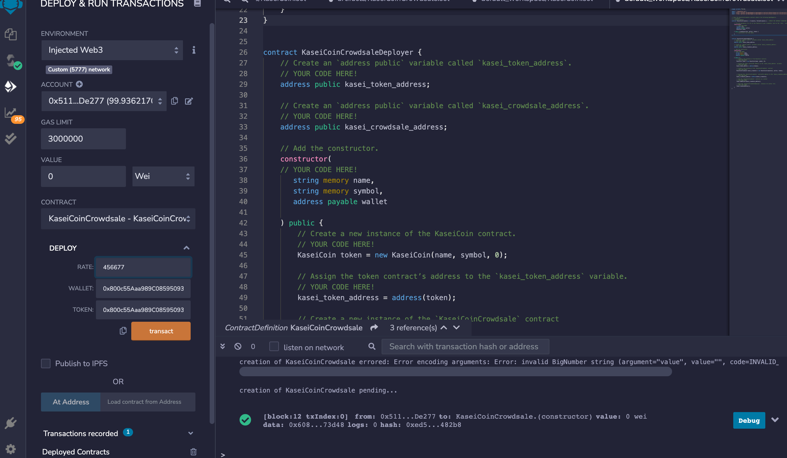

# KaseiCoin Token Crowdsale

KaseiCoin fungible token was created and ERC-20 compliant

This crowdsale contract create manages the entire crowdsale process, allowing users to send ether to the contract and in return receive KAI, or KaseiCoin tokens. This smart contract will mint the tokens automatically and distribute them to buyers in one transaction.

The KaseiCoin Token crowdsale is deployed to a local Blockchain : Ganache

## Here are two screen shots of block 12 and block 13 with a successful purchases

## Here is a screenshot of MetaMask prompting to confirm the gas fees for these transactions

## Here is a screenshot of the Ganache Blockchain referencing the two test transactions for KaseiCoin Token Crowdsales
